# Awesome AI Finance Assistant 🤖💰

  

  
  
  
  
  

---

## 📌 Overview & Category Intelligence 💡

> **Market Insights:** The AI Financial Operations and Conversational Accounting software sector is estimated at **$12.5 Billion (2026)** with an estimated **24.8% CAGR**. The market is **moderately fragmented**, featuring legacy ERP incumbents (Microsoft, Oracle NetSuite) expanding into AI copilots alongside fast-growing venture-backed AI-native startups (Rillet, Vic.ai, Numeric, Digits).

This repository tracks premier **SaaS platforms** and production-capable **open-source projects** for **AI Finance Assistants**, **AI-Native ERPs**, **Automated Reconciliations**, and **Autonomous Bookkeeping**.

---

## 📋 Table of Contents 📑

- [🏢 SaaS & Hosted Platforms](#-saas--hosted-platforms)
- [🔓 Open-Source GitHub Projects](#-open-source-github-projects)
- [🤝 How to Contribute](#-how-to-contribute)
- [☕ Support & Sponsorship](#-support--sponsorship)
- [⭐ Star History](#-star-history)
- [⚠️ Disclaimer](#%EF%B8%8F-disclaimer)

---

## 🏢 SaaS & Hosted Platforms 🚀

*(Sorted by enterprise scale / valuation descending)*

| Platform | Starting Tier Price 💳 | Free Tier / Trial Limits ⏳ | Estimated Scale / Valuation 📈 | Description & Key Capabilities 🎯 |
| :--- | :--- | :--- | :--- | :--- |
| **[Microsoft Copilot for Finance](https://www.microsoft.com/en-us/copilot/finance)** | **$30 / user / month** (add-on to Microsoft 365 Copilot) | **30-day free trial** (up to 25 user licenses) | **~$3.1 Trillion** market cap parent (Enterprise Tier) | AI assistant embedded in M365 (Excel, Outlook, Dynamics 365) for variance analysis, reconciliation, and automated reporting. |
| **[Vic.ai](https://www.vic.ai/)** | **$500 / month** (starter tier base) | **14-day guided trial** (up to 50 processed invoice documents) | **$1.0 Billion+** valuation (Series C) | Autonomous AP & invoice processing engine using computer vision and LLMs for line-item coding and anomaly detection. |
| **[Datarails](https://www.datarails.com/)** | **$1,000 / month** (annual base tier) | **14-day interactive sandbox demo** (pre-loaded financial model) | **$400 Million** valuation (Series B) | Excel-native FP&A automation platform providing AI financial storytelling and multi-subsidiary consolidation. |
| **[Digits](https://digits.com/)** | **$199 / month** (Digits Search & Reports) | **Free Forever Tier** (Basic transaction search & analytics for 1 company) | **$500 Million** valuation (Series C) | Living accounting platform with conversational AI ("Ask Digits") built directly on top of real-time general ledger data. |
| **[Numeric](https://www.numeric.io/)** | **$300 / month** (Essential Tier) | **14-day free trial** (1 ERP connection, up to 5 reconciliations) | **$300 Million** valuation (Series A) | AI-first close management platform automating month-end flux analysis, technical accounting memos, and reconciliations. |
| **[Rillet](https://www.rillet.com/)** | **$450 / month** (Growth Tier) | **14-day free trial** (up to 200 general ledger transactions) | **$150 Million** valuation (Series A) | AI-native zero-latency ERP replacing traditional GLs with autonomous journal entry booking and continuous close capabilities. |
| **[Booke AI](https://booke.ai/)** | **$20 / month** (per business / client) | **14-day free trial** (unlimited transaction categorization review) | **~$20 Million** valuation (Seed) | AI robotic bookkeeper operating directly inside QuickBooks Online and Xero for 95%+ autonomous transaction categorization. |
| **[Bluecopa](https://bluecopa.com/)** | **$250 / month** (Startup Tier) | **14-day free trial** (up to 1,000 transaction reconciliations) | **~$15 Million** valuation (Seed) | AI-powered reconciliation and finance operations platform built for high-volume enterprise transactions. |
| **[Osfin AI](https://osfin.ai/)** | **$350 / month** (Standard Tier) | **14-day free trial** (up to 5,000 reconciliation matches) | **~$12 Million** valuation (Seed) | Enterprise financial reconciliation & close automation engine supporting complex multi-channel data matching. |
| **[Truewind](https://www.truewind.ai/)** | **$299 / month** (Starter Accounting Tier) | **14-day free trial** (1 entity, up to 100 journal entries) | **~$10 Million** valuation (Seed) | AI accounting assistant focused on source-linked workpaper generation and exception-first audit preparation. |

---

## 🔓 Open-Source GitHub Projects ⚡

*(Sorted by GitHub Star count descending)*

### 🌟 Community Stars Benchmark

1. **[ERPClaw](https://github.com/avansaber/erpclaw)** 
   - **Type:** AI-Native ERP & General Ledger (GPL-3.0)
   - **Key Features:** Conversational accounting ("chat with your books"), full US GAAP compliance, double-entry GL, multi-currency, ASC 606 revenue recognition, self-hosted SQLite/PostgreSQL. $0 forever.

2. **[Actual Budget](https://github.com/actualbudget/actual)** 
   - **Type:** Local-First Personal & Business Finance (MIT)
   - **Key Features:** Privacy-focused double-entry envelope budgeting, bank syncing, custom automation rules, multi-device sync, extensible API for LLM agent integration.

3. **[Firefly III](https://github.com/firefly-iii/firefly-iii)** 
   - **Type:** Self-Hosted Financial Manager (AGPL-3.0)
   - **Key Features:** Full double-entry transaction management, rule-driven automation, recurring transaction engine, comprehensive REST API for external AI budget copilots.

4. **[TaxHacker](https://github.com/vas3k/TaxHacker)** 
   - **Type:** LLM Receipt & Invoice Analyzer (MIT)
   - **Key Features:** Self-hosted OCR & document parser, custom prompts & categories, native support for local LLMs (Ollama, LM Studio, vLLM) and OpenAI/Anthropic APIs.

5. **[ezBookkeeping](https://github.com/mayswind/ezbookkeeping)** 
   - **Type:** Lightweight Go Personal Finance & MCP (Apache-2.0)
   - **Key Features:** AI receipt image recognition, native Model Context Protocol (MCP) support for AI agents, multi-currency, SQLite/MySQL/Postgres deployment.

6. **[cfo-stack](https://github.com/MikeChongCan/cfo-stack)** 
   - **Type:** AI CFO & Beancount Skills (MIT)
   - **Key Features:** 27 specialized AI skills covering capture, CSV import, receipt OCR, double-entry logging, AI tax planning, and Chrome DevTools MCP statement exports.

7. **[dsh-finance](https://github.com/zhang787jun/dsh-finance)** 
   - **Type:** DeepSeek Harness Accounting Plugin (MIT)
   - **Key Features:** Deterministic validation tools (`finance_journal_entry_check`, `finance_reconciliation_snapshot`, `finance_variance_bridge`) ensuring strict human-in-the-loop review.

8. **[Taraz](https://github.com/amirrstm/Taraz)** 
   - **Type:** Cryptographic Ledger & IFRS Reporting (MIT)
   - **Key Features:** SHA-256 ledger immutability verification, structured IFRS reporting templates, offline-first accounting client.

---

## 🤝 How to Contribute 🛠️

Contributions are warmly welcome! Help make this the most comprehensive list for AI in Finance:

1. Fork the repository.
2. Follow existing formatting conventions (tables for SaaS, star-sorted badges for Open-Source).
3. Ensure pricing and free tier specs are factual and linked to official documentation.
4. Submit a Pull Request with a clear summary of additions.

Refer to [Awesome List Guidelines](https://github.com/ishandutta2007/Awesome-Awesome-Awesome) for best practices.

---

## ☕ Support & Sponsorship 💖

If this repository saved you research time or assisted in building your AI finance stack, please consider supporting the project:

- ⭐ **Star this repository** on GitHub to increase visibility!
- 🔀 **Fork & Share** with fellow engineers, CFOs, and finance tech leads.
- ☕ **Buy me a coffee / Sponsor**: [https://github.com/sponsors/ishandutta2007](https://github.com/sponsors/ishandutta2007)

Your support keeps this repository updated with the latest 2026 AI finance developments!

---

## ⭐ Star History 📊

---

## ⚠️ Disclaimer 📜

- This repository is a community-curated directory for informational and educational purposes.
- AI finance assistants handle sensitive ledger data and financial calculations; ensure compliance with SOC 2, US GAAP, IFRS, and local tax compliance before deployment.
